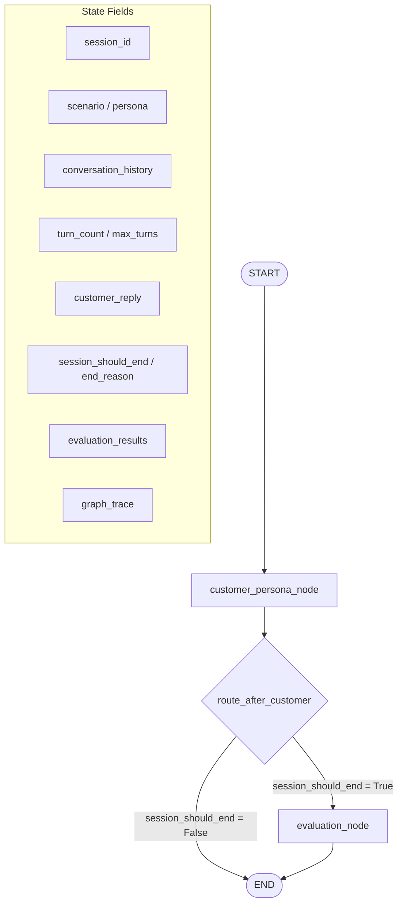
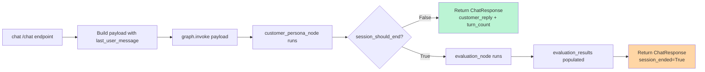
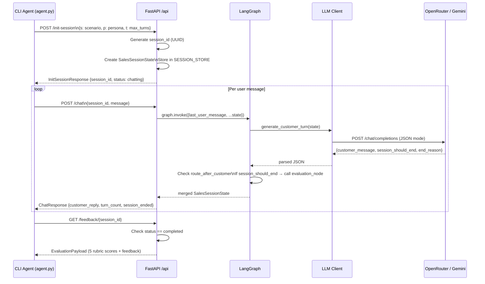
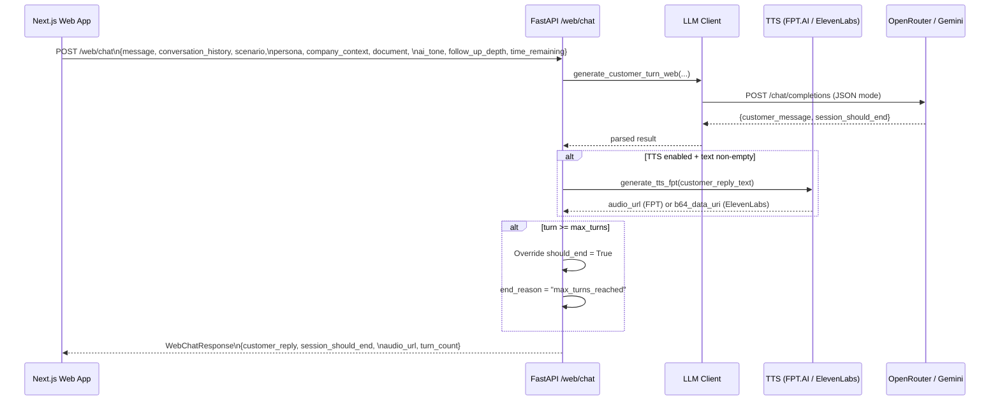
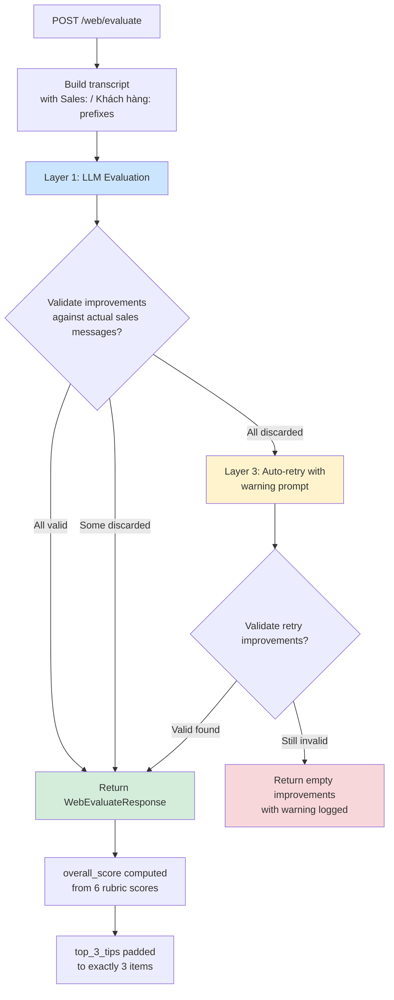
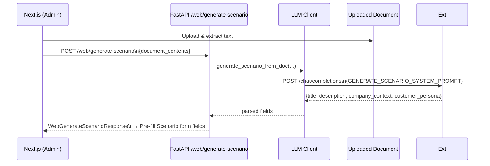
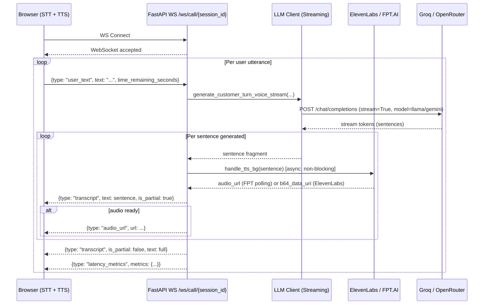
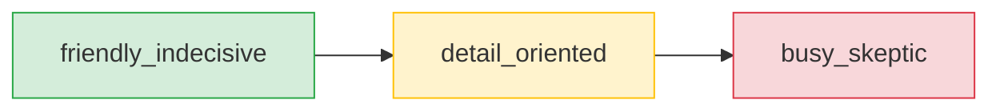
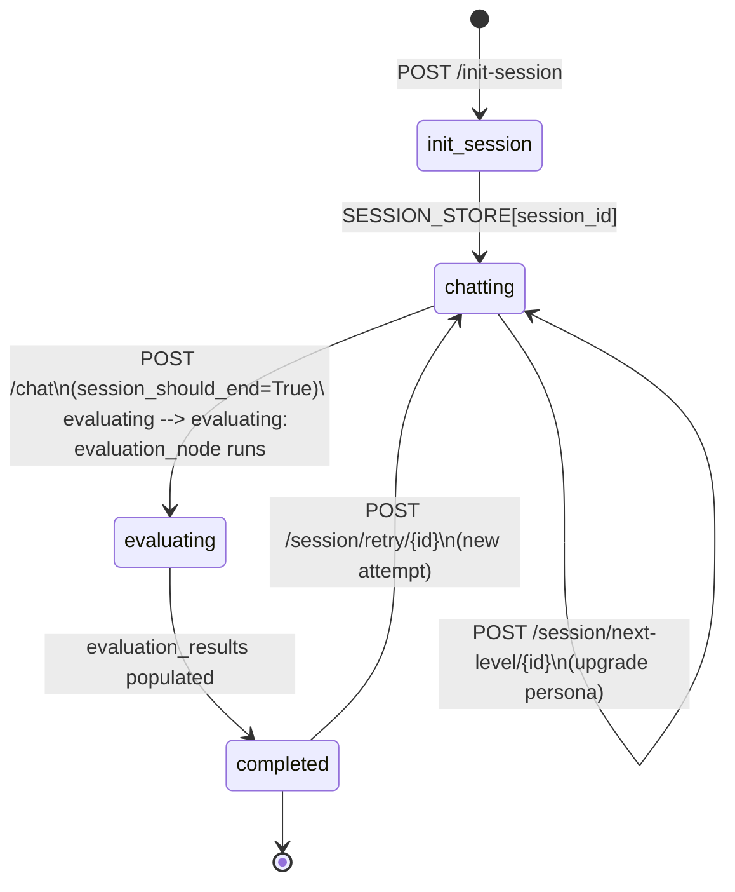

# Sale Train Agent — Core Agent Workflow & Architecture

## 1. System Overview

Sale Train Agent là nền tảng đào tạo Sales B2B dựa trên AI, cho phép nhân viên Sales luyện tập đóng vai (role-play) với các buyer personas mô phỏng bởi LLM trong thời gian thực. Hệ thống được xây dựng với **FastAPI** + **LangGraph** + **LLM (OpenRouter / Gemini / Anthropic / Groq)**.

### 1.1 Technology Stack

```
Frontend (Next.js Web App)
         ↕  HTTP/REST + WebSocket
─────────────────────────────────────────────
FastAPI Server (api/main.py)
    ├── State Management: LangGraph StateGraph
    ├── LLM Layer: llm/llm_client.py
    │       ├── OpenAI / OpenRouter / Gemini (JSON-mode)
    │       └── Groq (async streaming)
    ├── TTS Layer: tools/tts_*.py
    │       ├── FPT.AI TTS v5
    │       └── ElevenLabs (Base64)
    └── Auth: API key verification (api/auth.py)
─────────────────────────────────────────────
External APIs:
    ├── OpenRouter / Gemini / Groq (LLM)
    ├── FPT.AI / ElevenLabs (TTS)
    └── Supabase DB (Web App — lưu transcripts)
```

---

## 2. Core Agent — LangGraph Workflow

Đây là trái tim của hệ thống, được sử dụng bởi CLI/Mobile endpoints (`/init-session`, `/chat`, `/feedback`).

### 2.1 State Graph Architecture



### 2.2 Node: `customer_persona_node`

**Input:** `SalesSessionState` với `last_user_message`

**Process:**
1. Lấy `last_user_message` từ state
2. Gọi `generate_customer_turn(state)` → LLM JSON-mode
3. Đóng gói lịch sử hội thoại (user + assistant)
4. Kiểm tra turn cap (`new_turn >= max_turns`)
5. Trả về partial state update

**Output keys:**
```python
{
    "conversation_history": [user_turn, asst_turn],  # Annotated list — append-only
    "turn_count": new_turn,
    "customer_reply": str,
    "session_should_end": bool,
    "end_reason": str | None,
    "current_status": "chatting",
    "graph_trace": ["customer_persona"],
}
```

### 2.3 Node: `evaluation_node`

**Trigger:** Khi `session_should_end = True`

**Process:**
1. Gọi `generate_evaluation(state)` → LLM JSON-mode
2. Đánh giá toàn bộ `conversation_history` theo 5 tiêu chí rubric
3. Trả về structured feedback

**Output keys:**
```python
{
    "current_status": "completed",
    "evaluation_results": EvaluationResults,  # 5 scores + strengths + mistakes + suggestion
    "graph_trace": ["evaluation"],
}
```

### 2.4 Conditional Routing Logic



### 2.5 End Conditions (session_should_end)

| Trigger | `end_reason` |
|---------|-------------|
| LLM xác định deal đã đóng thành công | `"deal_closed"` |
| Khách hàng ngắt máy / từ chối | `"customer_hung_up"` |
| User nói "stop", "end session" | `"user_ended"` |
| `turn_count >= max_turns` | `"max_turns_reached"` |
| Vi phạm nghiêm trọng (nói sai thông tin) | `"violation"` |

---

## 3. CLI / Mobile Flow



---

## 4. Web App Flow (Next.js — Stateless)

Web App sử dụng 3 endpoint riêng, không dùng LangGraph state graph. Mỗi request chứa toàn bộ context cần thiết.

### 4.1 Chat Flow



### 4.2 Evaluation Flow (3-Layer Anti-Hallucination)



### 4.3 Scenario Generation Flow



---

## 5. Voice Call Flow (WebSocket — Real-time)



### 5.1 Latency Metrics Tracked

| Metric | Description |
|--------|-------------|
| `text_length` | Số ký tự user message |
| `client_sent_at_ms` | Thời điểm client gửi |
| `client_stt_final_at_ms` | Thời điểm STT hoàn tất |
| `llm_ms` | Tổng thời gian LLM generate |
| `backend_total_ms` | Từ receive → gửi xong |
| TTS total + polling | Thời gian TTS + FPT polling |

---

## 6. Persona Difficulty Ladder



| Level | Persona | Đặc điểm | Scoring bias |
|-------|---------|-----------|-------------|
| 1 | `friendly_indecisive` | Ấm áp, quan tâm, nhưng trì hoãn mãi | Cần tạo urgency |
| 2 | `detail_oriented` | Phân tích, hỏi chi tiết, so sánh đối thủ | Cần deep product knowledge |
| 3 | `busy_skeptic` | Bận rộn, thiếu kiên nhẫn, yêu cầu hook nhanh | Cần conciseness + direct value |

---

## 7. LLM Model Routing

```mermaid
flowchart TD
    A[Request] --> B{Has OPEN_ROUTER_API?}

    B -->|Yes| C[OpenAI client → openrouter.ai/v1]
    B -->|No| D{Has GEMINI_API_KEY?}

    D -->|Yes| E[OpenAI client → generativelanguage.googleapis.com]
    D -->|No| F{Has GROQ_API_KEY?}

    F -->|Yes| G[AsyncOpenAI → api.groq.com/v1]
    F -->|No| H[OpenAI client → api.openai.com/v1]

    C --> I[Model: google/gemini-2.5-flash-lite\n(default, gpt* auto-fallback)]
    E --> J[Model: gemini-2.5-flash-lite]
    G --> K[Model: llama-3.3-70b-versatile (voice)]
    H --> L[Model: OPENAI_API_KEY default]

    style C fill:#e8f4fd
    style E fill:#fff8e1
    style G fill:#e8f5e9
    style H fill:#fce4ec
```

---

## 8. Evaluation Rubrics

### 8.1 CLI Rubric (5 criteria)

| Criterion | Mô tả |
|-----------|-------|
| `understanding_needs` | Discovery, listening, acknowledging pain |
| `response_structure` | Clarity, concision, professionalism |
| `objection_handling` | Empathy, reframe, non-defensive |
| `persuasiveness` | Value tied to buyer's problems |
| `next_steps` | Close / micro-commitment |

> **overall_score** = arithmetic mean của 5 scores (computed, not LLM-supplied)

### 8.2 Web Rubric (6 criteria)

| Criterion | Mô tả |
|-----------|-------|
| `process_adherence` | Đủ bước chào hỏi, nêu lý do gọi |
| `talk_to_listen` | Sale nói quá nhiều so với lắng nghe |
| `discovery_depth` | Dùng câu hỏi mở để hiểu vấn đề |
| `confidence` | Không dùng từ đệm thừa |
| `objection_handling` | Đồng cảm + nêu lợi ích |
| `next_step` | Thiết lập lịch hẹn / hành động cụ thể |

> **overall_score** = mean(scores) × 10 → scale 0–100

---

## 9. API Endpoint Summary

```mermaid
flowchart TD
    subgraph "CLI / Mobile Endpoints (LangGraph + SESSION_STORE)"
        E1[GET /health]
        E2[POST /init-session]
        E3[POST /chat]
        E4[GET /feedback/{session_id}]
        E5[POST /session/retry/{session_id}]
        E6[POST /session/next-level/{session_id}]
    end

    subgraph "Web App Endpoints (Stateless + API Key)"
        W1[POST /web/chat]
        W2[POST /web/evaluate]
        W3[POST /web/generate-scenario]
    end

    subgraph "Real-time Voice"
        V1[WS /ws/call/{session_id}]
    end

    style E2 fill:#bbf4d4
    style E3 fill:#ffd6a5
    style E4 fill:#d4c5f9
    style W1 fill:#bbf4d4
    style W2 fill:#d4c5f9
    style W3 fill:#e8f4fd
    style V1 fill:#fff3cd
```

---

## 10. Session Lifecycle


